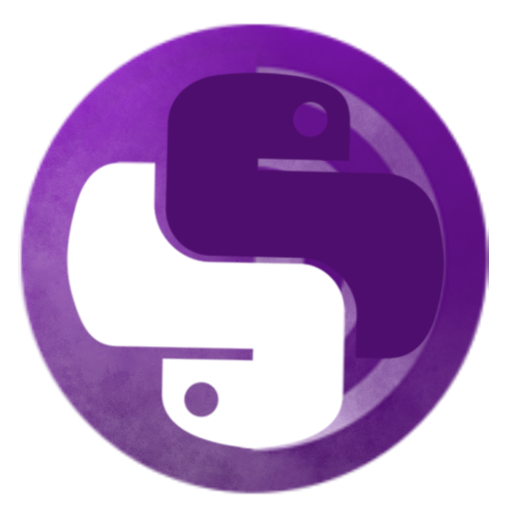
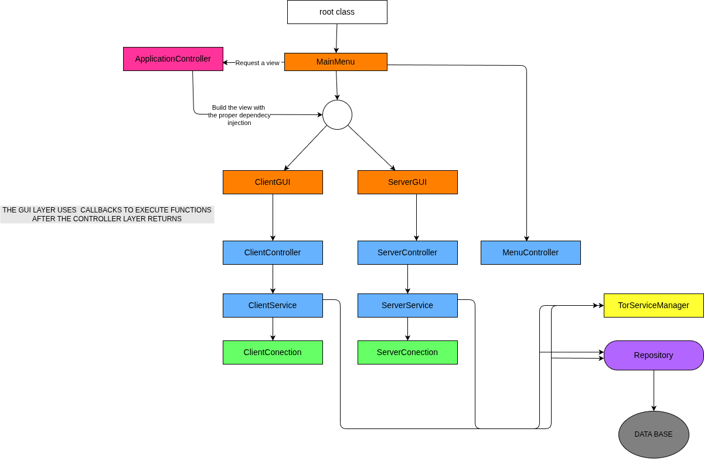

# OnionPy Visual Chat

<p align="center">
  
</p>

A graphical application for hosting and connecting to onion-based chat services, 
enabling the creation of multiple independent Tor hidden services with minimal setup.
Built with CustomTkinter, asyncio, and the Tor control library Stem.


## Features
- CustomTkinter interface providing easy and intuitive access to the application features.
 
- No need to setup onion configuration files - just enter a valid server name and you're done.
 
- Easy creation of onion clients using Tor as a proxy by simply typing the desired onion adress.
 
- Informative view with popup notifications about connection status and erros.
 
- Multithreaded asynchronous application providing a smooth and non-blocking interface.
-
- Option to manage the local servers and recent connections.
 
- Create servers with special requirements such as passwords and authentication keys.
 
- Options to mute certain users connected to you server.
 


## Requirements
- Python 3.8+
- Dependencies listed in `requirements.txt`

## Install
```bash
git clone https://github.com/CaioMaxximus/onion_py_chat.git
cd web_chat_with_tkinter
chmod +X start_app.sh

```
## Execute

APP
```bash
./start_app.sh 
```
TESTS
```bash
./run_tests.sh
```
## Control flow architecture



## Tests

- TorServiceManager 
- client_connection 
- server_connection 
- client_controller 
- basic_async_controller 
- menu_controller 
- server_controller 

## Project Structure
```
├── assets/
├── components/
│   └── message_frame.py
├── connection/
│   ├── __init__.py 
│   ├── client_connection.py 
│   ├── server_connection.py 
│   └── tor_service_manager.py 
├── controller/
│   ├── __init__.py
│   ├── basic_async_controller.py 
│   ├── client_controller.py 
│   ├── menu_controller.py 
│   └── server_controller.py 
├── coordinator/
│   └── application_coordinator.py 
├── data_base/
│   ├── db_service_manager.py 
│   └── repository.py 
├── error/
│   └── special_errors.py 
├── infrastructure/
│   ├── __init__.py 
│   └── notification_bus.py
├── models/
│   ├── __init__.py 
│   ├── discovered_server.py 
│   ├── notification.py 
│   ├── onion_server.py
│   └── user.py 
├── personalized_wigdets/
│   ├── __init__.py 
│   └── item_list_view.py 
├── popups/
│   ├── __init__.py 
│   ├── popup_choice_gui.py
│   ├── popup_entry_gui.py
│   └── popup_notification_gui.py 
├── services/
│   ├── __init__.py
│   ├── client_service.py 
│   └── server_service.py 
├── themes/
├── views/
│   ├── __init__.py
│   ├── basic_chat_view.py 
│   ├── client_gui.py 
│   ├── configuration_gui.py 
│   ├── main_menu_gui.py 
│   └── server_gui.py 
├── __init__.py 
└── root.py 

```

## Contact
- Author: Caio Maxximus
- Email: puntmaxximus@gmail.com


