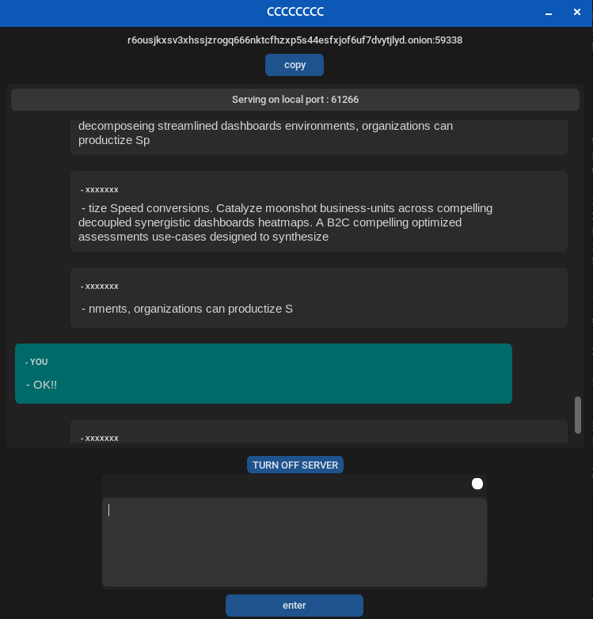
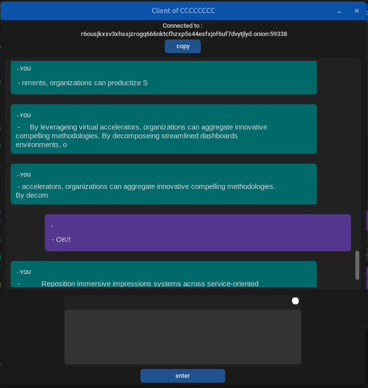

# OnionPy Visual Chat

<p align="center">
  
</p>

A graphical application for hosting and connecting to onion-based chat stateless servers, 
enabling the creation of multiple independent Tor hidden services with minimal setup.
Built with CustomTkinter, asyncio, and the Tor control library Stem.

## Status

  - Adding loggin and more tests

## ✨ Features

| Feature | Status | Description |
|---------|--------|-------------|
| **CustomTkinter GUI** | ✅ Done | Intuitive desktop interface |
| **Zero-Config Onion Setup** | ✅ Done | Create Tor hidden services without config files |
| **Client/Server** | ✅ Done | Connect to any address, host multiple servers |
| **Password Protected Servers** | ✅ Done | Optional  access control |
| **Real-time Notifications** | ✅ Done | Connection status, errors, and alerts |
| **Secure Credentials** | ✅ Done | Passwords Option  |
| **Persistent Storage** | ✅ Done | Retrieve local servers and discovered servers |
| **Async Non-Blocking UI** | ✅ Done | Smooth, responsive interface via asyncio |
| **Connection Management** | ✅ Done | View, manage, and delete saved servers |

---

## 🔒 Security 
#### All the connection runs over the tor network using tor as a proxy service and onion servers for the chat servers, also passwords allow the creation of protected servers. The Tor daemon runs using a unique random password generated each time the applications starts, protecting the controll port.

- ⚠️ **X**: The software lacks a third-party security audit. Review the source code before deployment in critical environments.


## Requirements

- Linux machine
- tkinter
- Docker 
- Python 3.9+
- Python enviroment creator module
- To run the build steps you need to have special permissions for your docker : https://docs.docker.com/engine/install/linux-postinstall/#manage-docker-as-a-non-root-user


## Install

**ATENTION** Tkinter is not installed via pip and generaly don't come by default in the python distributions. If you don't have it, you will need to install it using the appropriate package manager for your Linux version.

**ATENTION 2**  The same goes for the venv module: you'll need to install it separately if you don't have it:

  ```bash
  sudo apt update
  sudo apt install python3-venv

  ```
  Or use the proper method for your python version

### With the enviroment ready you can start the instalation process

```bash
git clone https://github.com/CaioMaxximus/onionpy-visual-chat.gi
```
#### Then, inside the project folder:

```bash
make install
```
## Execute

APP
```bash
make run
```
TESTS
```bash
./run_tests.sh
```
## Control flow architecture


## Screenshots



## -------


## Future features

  **A conection keeper for not stable connections**
  **A visual indicator for the lazyscroller chat view, indicating bottom or top**


## Contact
- Author: Caio Maxximus
- Email: puntmaxximus@gmail.com


