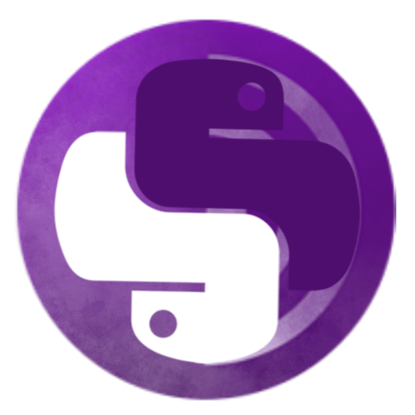
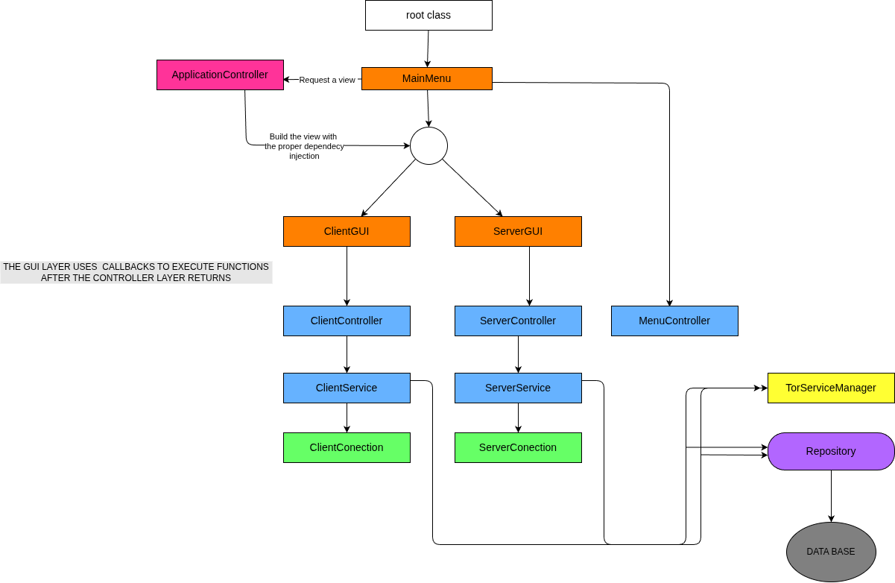

# OnionPy Visual Chat

<p align="center">
  
</p>

A graphical application for hosting and connecting to onion-based chat stateless servers, 
enabling the creation of multiple independent Tor hidden services with minimal setup.
Built with CustomTkinter, asyncio, and the Tor control library Stem.

## Status

  - Cleaning architecture

## ✨ Features

| Feature | Status | Description |
|---------|--------|-------------|
| **CustomTkinter GUI** | ✅ Done | Intuitive desktop interface |
| **Zero-Config Onion Setup** | ✅ Done | Create Tor hidden services without config files |
| **P2P Client/Server** | ✅ Done | Connect to any onion address, host multiple servers |
| **Password Protected Servers** | ✅ Done | Optional  access control |
| **Real-time Notifications** | ✅ Done | Connection status, errors, and alerts |
| **Message Broadcasting** | ✅ Done | Async message delivery to all connected clients |
| **Secure Credentials** | ✅ Done | Passwords hashed  |
| **Persistent Storage** | ✅ Done | SQLite database for servers and connections |
| **Async Non-Blocking UI** | ✅ Done | Smooth, responsive interface via asyncio |
| **Connection Management** | ✅ Done | View, manage, and delete saved servers |

---

## 🔒 Security Considerations

### Implemented
- ✅ **Password Hashing**: bcrypt with random salt (never plaintext in DB)
- ✅ **Handshake Protocol**: JSON-based with mandatory authentication fields
- ✅ **Tor Routing**: All traffic routed through Tor hidden services

- ⚠️ **X**: The software lacks a third-party security audit. Review the source code before deployment in critical environments.


## Requirements

- Linux machine
- tkinter
- Docker 
- Python 3.9+
- Python enviroment creator module
- To run the build steps you need to have special permissions for your docker : https://docs.docker.com/engine/install/linux-postinstall/#manage-docker-as-a-non-root-user


## Install

**ATENTION** Tkinter is not installed via pip and generaly don't come by default in the python distributions. If you don't have it, you will need to install it using the appropriate package manager for your Linux version.

**ATENTION 2**  The same goes for the venv module: you'll need to install it separately if you don't have it:

  ```bash
  sudo apt update
  sudo apt install python3-venv

  ```
  Or use the proper method for your python version

### With the enviroment ready you can start the instalation process

```bash
git clone https://github.com/CaioMaxximus/onionpy-visual-chat.gi
```
#### Then, inside the project folder:

```bash
make install
```
## Execute

APP
```bash
make run
```
TESTS
```bash
./run_tests.sh
```
## Control flow architecture



## Tests

- TorServiceManager 
- client_connection 
- server_connection 
- basic_async_controller 
- menu_controller 

## Project Structure


## Future features
  **A conection keeper for not stable connections**

## Contact
- Author: Caio Maxximus
- Email: puntmaxximus@gmail.com


